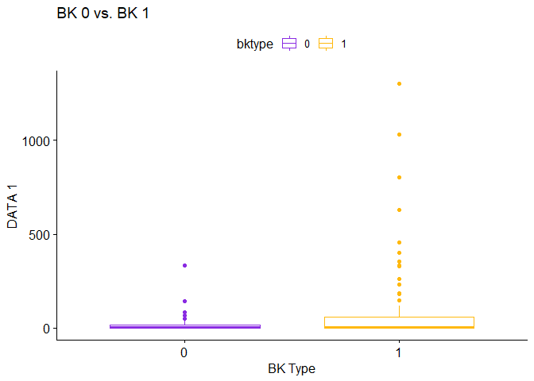
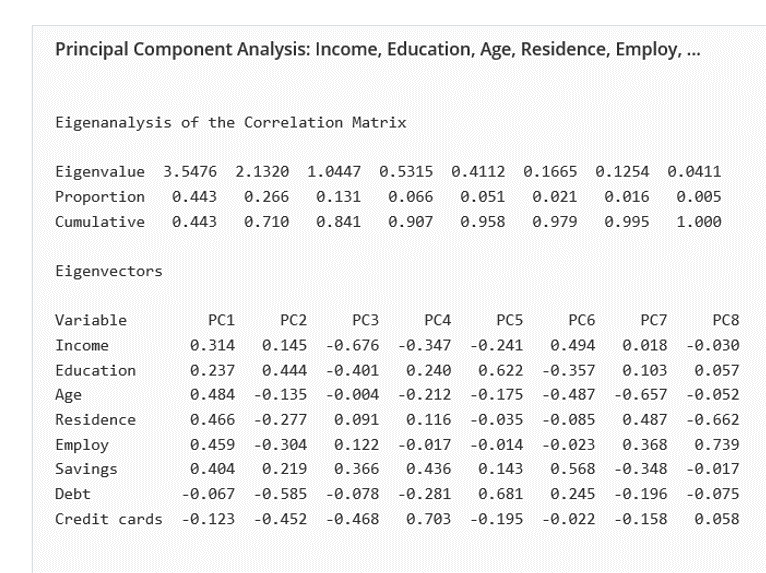
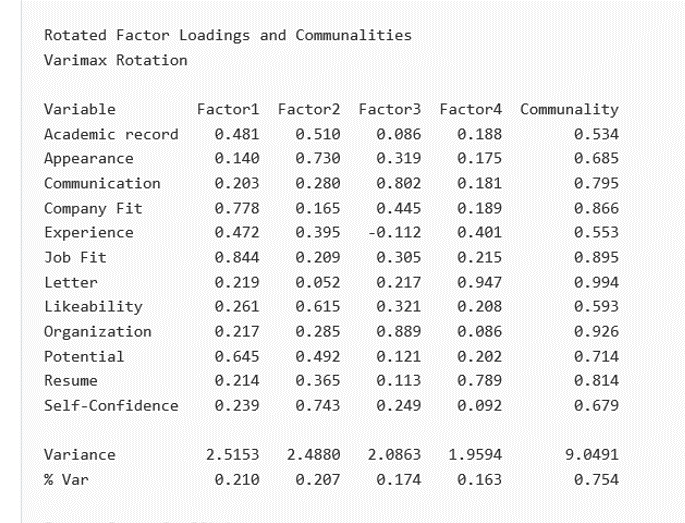
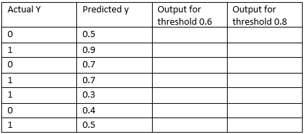
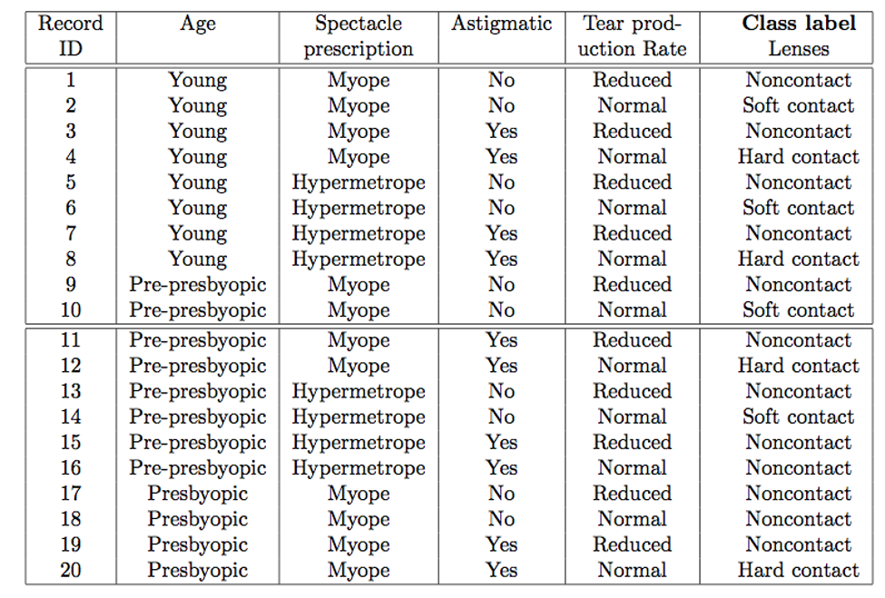
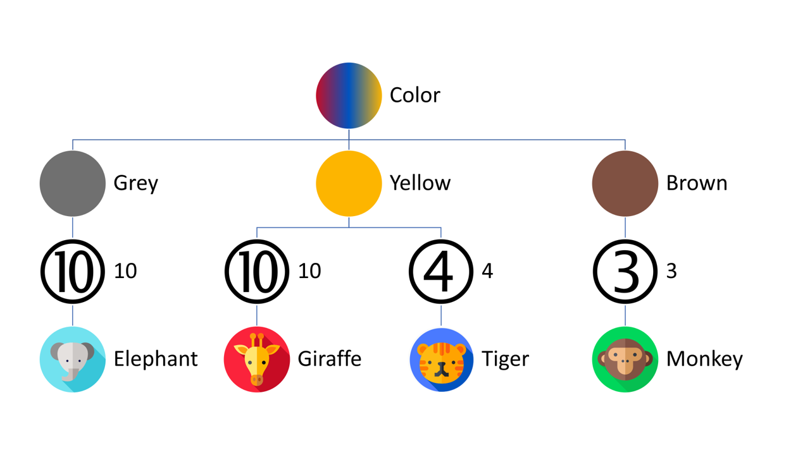
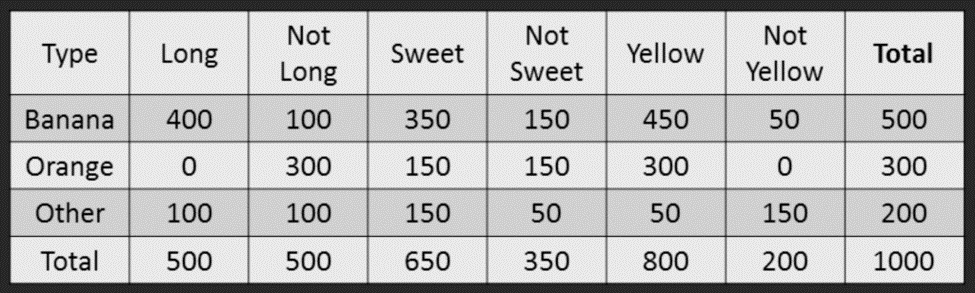
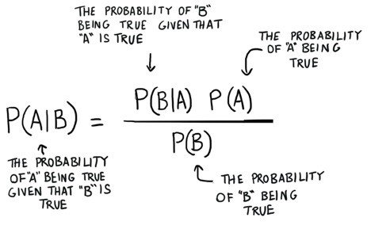

TBANLT 560 | Data Mining Midterm Exam
================
C.E.Weiner
2/23/2020

## Instructions

**There are ten questions. Each question may cover several topics. The
exam is Due on February 23rd. Submit it online. Each question 1 to 10 is
worth 10 points. It should take you from 2 to 4 hours.**

*NOTE: In questions 2, 3, 6, 7A, include all r code or other methods
used. For example, it is possible to use Excel to carry out some of the
analysis. If you use Excel or something other than R take a screen shot
of the setup and the results. Basically, show your work.*

## 1

**A hospital is interested in learning about the risk of readmission for
people who were treated for a specific chronic ailment. They want to
know what contributes to an individual’s risk of readmission. Risk of
readmission is based on the likelihood that the person will come back to
the hospital within a short period of time. There are several data
mining tasks that are relevant in this situation. Discuss the relevant
ones and how the analysis may be of value to the hospital.**

> There are 10 Steps in Data Mining and most of them are applicable (and
> self explanatory) in this scenario.
> 
> 1.  *Develop an understanding of the purpose of the data mining
>     project.*  
> 2.  *Obtain the dataset to be used in the analysis.*  
>     For this the hospital needs to to isolate the data specific to
>     patients with the specific chronic ailment. This can be easily
>     done by applying a filter to the initial data pull.  
> 3.  *Explore, clean, and preprocess the data*  
>     I would recommending starting with an exploratory data analysis
>     (EDA). This would allow the hospital to identify which variables
>     are significant, what data points are outliers, and what
>     information may be missing.  
> 4.  *Reduce the data dimension, if necessary.*  
>     Since hospital data sets tend to be quite large, they may want to
>     utilize a smaller test set than the “standard” 60% split.
> 5.  *Determine the data mining task.*
> 6.  *Partition the data (for supervised tasks).*
> 7.  *Choose the data mining techniques to be used.*  
>     The data mining technique would be dependent on the variables that
>     were identified as being highly correlated. Linear regressions
>     tend to be the easiest to understand so that would be a good
>     starting point. If there were many categorical variables, a
>     multiple regression could be effective.  
> 8.  *Use algorithms to perform the task.*  
>     This would be one of the more involved parts of the process as it
>     is where the hospital would develop multiple variations of the
>     techniques they have selected. Validation data would be involved
>     at this point to provide feedback on the algorithm’s
>     performance.  
> 9.  *Interpret the results of the algorithms.*  
> 10. *Deploy the model.*

## 2

### A

**Describe a situation where you want to keep outliers. Describe one
where you don’t. Give an example of each.**

> When deciding how to treat an outlier, it is important to know your
> data set and the intention of the analysis. Say you are looking at
> elementary student performance scores across a school district.
> Outliers could be useful in identifying groups or even specific
> students who may need extra attention. Knowing your data will also
> help you to quickly identify outliers that should be dropped due to
> incorrectly entered data. For example, if a student is recorded as
> having a 991% on an exam we can assume that it is a typo since scores
> only go up to 100%.

### B

**Missing data can be problematic. There are several ways for handling
missing data. Given the following table define two data imputation
methods which we have covered for filling in the missing values.**

| SMBL   |   DATA1 |    DATA2 |    DATA3 |    DATA4 |    DATA5 |     DATA6 |     DATA7 |    DATA8 |
| :----- | ------: | -------: | -------: | -------: | -------: | --------: | --------: | -------: |
| AMCVQ  |  42.688 |    1.205 |    2.529 |   51.843 |   83.727 |   293.990 |   317.446 |  225.398 |
| AMCVQ  | 122.870 |    4.552 |    5.417 |  141.299 |  235.692 |   752.615 |   687.529 |  579.124 |
| FLMIQ  |  30.316 |  334.278 | 1018.666 | 1494.990 | 1154.597 |  3923.971 |  1598.786 |  949.843 |
| FLMIQ  |   5.967 |  450.905 |       NA | 1587.916 | 1281.084 |  3490.832 |  1554.884 |  820.065 |
| FLMIQ  |   6.683 |  496.159 |  997.805 | 1728.750 | 1283.719 |  3573.218 |  1539.465 |  838.176 |
| GRA    |  78.300 |  975.700 |  514.200 | 2228.900 |       NA |  6230.600 |  3228.300 | 1730.100 |
| GRA    |  40.600 |  596.800 |  491.900 | 1681.300 | 2214.200 |  6297.600 |  3154.900 | 1736.100 |
| GRA    |  68.300 |  831.400 |  376.100 | 1774.900 | 1487.100 |  4945.800 |  3307.900 | 1871.300 |
| 3ABNTQ |  10.769 |   24.714 |       NA |   57.870 |   43.906 |   217.751 |    92.565 |   50.138 |
| 3ABNTQ |   9.101 |   26.922 |   24.752 |   66.764 |       NA |   201.567 |   113.664 |   53.285 |
| 3ABNTQ |  14.009 |   22.981 |   21.229 |   66.798 |  138.719 |   184.281 |   105.423 |   42.931 |
| ENRNQ  | 114.917 | 1576.158 |  111.463 | 2726.907 | 2431.992 | 13238.940 | 11107.180 | 6868.435 |
| ENRNQ  | 256.000 | 2255.000 |  164.000 | 3979.000 | 3708.000 | 16137.000 | 11348.000 | 7112.000 |
| ENRNQ  | 170.000 | 2151.000 |       NA | 4669.000 | 4412.000 | 23422.000 | 13742.000 | 9170.000 |
| PTFC   |  49.095 |   68.454 |  327.389 |  460.970 |  318.313 |  1563.586 |  1099.739 |  612.082 |
| PTFC   |  43.474 |   62.420 |  283.631 |  404.144 | 1553.831 |  1228.061 |  1001.243 |  471.075 |
| PTFC   |  51.759 |   49.722 |  268.550 |  387.359 |  240.931 |  1020.457 |   309.609 |  287.098 |
| RVSIQ  |   0.465 |    2.157 |    2.136 |    5.449 |    6.215 |     7.889 |     3.191 |    1.317 |
| RVSIQ  |   3.063 |    3.412 |       NA |   10.406 |    5.742 |    14.988 |     3.226 |    1.923 |
| RVSIQ  |  17.407 |   11.884 |    8.074 |   39.894 |   15.313 |    47.288 |     7.269 |    3.999 |
| CQB    |  97.863 |  361.198 |  421.806 |  902.867 |  488.422 |  2596.127 |  1892.729 | 1177.823 |
| CQB    |  96.924 |  296.494 |  428.260 |  846.513 |  612.870 |  2416.790 |  1807.437 | 1071.341 |
| CQB    |  70.428 |  274.323 |  392.190 |  772.355 |       NA |  2262.492 |  1806.793 | 1005.606 |

> The easiest method of filling in missing values is to simply copy the
> value that is directly before or after it. A second, and possibly more
> accurate method is to insert the mean value

``` r
#select one of your methods to fill in the missing values in the table 
twob2 <-fill(twob,2:9, .direction = "down")
kable(twob2)
```

| SMBL   |   DATA1 |    DATA2 |    DATA3 |    DATA4 |    DATA5 |     DATA6 |     DATA7 |    DATA8 |
| :----- | ------: | -------: | -------: | -------: | -------: | --------: | --------: | -------: |
| AMCVQ  |  42.688 |    1.205 |    2.529 |   51.843 |   83.727 |   293.990 |   317.446 |  225.398 |
| AMCVQ  | 122.870 |    4.552 |    5.417 |  141.299 |  235.692 |   752.615 |   687.529 |  579.124 |
| FLMIQ  |  30.316 |  334.278 | 1018.666 | 1494.990 | 1154.597 |  3923.971 |  1598.786 |  949.843 |
| FLMIQ  |   5.967 |  450.905 | 1018.666 | 1587.916 | 1281.084 |  3490.832 |  1554.884 |  820.065 |
| FLMIQ  |   6.683 |  496.159 |  997.805 | 1728.750 | 1283.719 |  3573.218 |  1539.465 |  838.176 |
| GRA    |  78.300 |  975.700 |  514.200 | 2228.900 | 1283.719 |  6230.600 |  3228.300 | 1730.100 |
| GRA    |  40.600 |  596.800 |  491.900 | 1681.300 | 2214.200 |  6297.600 |  3154.900 | 1736.100 |
| GRA    |  68.300 |  831.400 |  376.100 | 1774.900 | 1487.100 |  4945.800 |  3307.900 | 1871.300 |
| 3ABNTQ |  10.769 |   24.714 |  376.100 |   57.870 |   43.906 |   217.751 |    92.565 |   50.138 |
| 3ABNTQ |   9.101 |   26.922 |   24.752 |   66.764 |   43.906 |   201.567 |   113.664 |   53.285 |
| 3ABNTQ |  14.009 |   22.981 |   21.229 |   66.798 |  138.719 |   184.281 |   105.423 |   42.931 |
| ENRNQ  | 114.917 | 1576.158 |  111.463 | 2726.907 | 2431.992 | 13238.940 | 11107.180 | 6868.435 |
| ENRNQ  | 256.000 | 2255.000 |  164.000 | 3979.000 | 3708.000 | 16137.000 | 11348.000 | 7112.000 |
| ENRNQ  | 170.000 | 2151.000 |  164.000 | 4669.000 | 4412.000 | 23422.000 | 13742.000 | 9170.000 |
| PTFC   |  49.095 |   68.454 |  327.389 |  460.970 |  318.313 |  1563.586 |  1099.739 |  612.082 |
| PTFC   |  43.474 |   62.420 |  283.631 |  404.144 | 1553.831 |  1228.061 |  1001.243 |  471.075 |
| PTFC   |  51.759 |   49.722 |  268.550 |  387.359 |  240.931 |  1020.457 |   309.609 |  287.098 |
| RVSIQ  |   0.465 |    2.157 |    2.136 |    5.449 |    6.215 |     7.889 |     3.191 |    1.317 |
| RVSIQ  |   3.063 |    3.412 |    2.136 |   10.406 |    5.742 |    14.988 |     3.226 |    1.923 |
| RVSIQ  |  17.407 |   11.884 |    8.074 |   39.894 |   15.313 |    47.288 |     7.269 |    3.999 |
| CQB    |  97.863 |  361.198 |  421.806 |  902.867 |  488.422 |  2596.127 |  1892.729 | 1177.823 |
| CQB    |  96.924 |  296.494 |  428.260 |  846.513 |  612.870 |  2416.790 |  1807.437 | 1071.341 |
| CQB    |  70.428 |  274.323 |  392.190 |  772.355 |  612.870 |  2262.492 |  1806.793 | 1005.606 |

## 3

***NOTE: For this question you will use the data set “dataforquestion3”
that is provided in the Exam module.***

### A

**Split the data into 10 equal (roughly) partitions. That means that you
will have 633/10 records in each partition. Determine the number of
records with a value of BK = 0 in each partition.**

``` r
three <- read_excel("./MidtermData.xlsx",sheet = "Q3DATA")
```

    ## New names:
    ## * DATA1 -> DATA1...27
    ## * DATA4 -> DATA4...28
    ## * DATA5 -> DATA5...29
    ## * DATA6 -> DATA6...30
    ## * DATA8x -> DATA8x...31
    ## * ... and 35 more problems

``` r
#manual method of splitting
part1<-three[1:63,]
part2<-three[64:126,]
part3<-three[127:189,]
part4<-three[190:252,]
part5<-three[253:314,]
part6<-three[315:377,]
part7<-three[378:441,]
part8<-three[442:504,]
part9<-three[505:567,]
part10<-three[568:633,]

cat(paste("Part 1 Record Count where BK is '0'= ",nrow(part1)-sum(part1$bktype)),
    paste("Part 2 Record Count where BK is '0'= ",nrow(part2)-sum(part2$bktype)),
    paste("Part 3 Record Count where BK is '0'= ",nrow(part3)-sum(part3$bktype)),
    paste("Part 4 Record Count where BK is '0'= ",nrow(part4)-sum(part4$bktype)),
    paste("Part 5 Record Count where BK is '0'= ",nrow(part5)-sum(part5$bktype)),
    paste("Part 6 Record Count where BK is '0'= ",nrow(part6)-sum(part6$bktype)),
    paste("Part 7 Record Count where BK is '0'= ",nrow(part7)-sum(part7$bktype)),
    paste("Part 8 Record Count where BK is '0'= ",nrow(part8)-sum(part8$bktype)),
    paste("Part 9 Record Count where BK is '0'= ",nrow(part9)-sum(part9$bktype)),
    paste("Part 10 Record Count where BK is '0'= ",nrow(part10)-sum(part10$bktype)),
    paste("Total Record Count where BK is '0'= ",nrow(three)-sum(three$bktype)),
    sep = '\n')
```

    ## Part 1 Record Count where BK is '0'=  13
    ## Part 2 Record Count where BK is '0'=  6
    ## Part 3 Record Count where BK is '0'=  15
    ## Part 4 Record Count where BK is '0'=  4
    ## Part 5 Record Count where BK is '0'=  6
    ## Part 6 Record Count where BK is '0'=  10
    ## Part 7 Record Count where BK is '0'=  10
    ## Part 8 Record Count where BK is '0'=  3
    ## Part 9 Record Count where BK is '0'=  5
    ## Part 10 Record Count where BK is '0'=  7
    ## Total Record Count where BK is '0'=  79

``` r
#loop method of splitting
partitions<- split(three, sample(1:10, nrow(three), replace=TRUE))
for (i in 1:10){
  assign(paste("partition", i, sep=""), as.data.frame(partitions[i]))
  }
x= c(sum(partition1$X1.bktype==0),
        sum(partition2$X2.bktype==0),
        sum(partition3$X3.bktype==0),
        sum(partition4$X4.bktype==0),
        sum(partition5$X5.bktype==0),
        sum(partition6$X6.bktype==0),
        sum(partition7$X7.bktype==0),
        sum(partition8$X8.bktype==0),
        sum(partition9$X9.bktype==0),
        sum(partition10$X10.bktype==0))
t=c("Total",sum(three$bktype==0))

count_frame <- data.frame(frame=seq(1,10,1), records_where_bk_0 = x)
count_frame <- rbind(count_frame, t)
count_frame
```

    ##    frame records_where_bk_0
    ## 1      1                  4
    ## 2      2                 11
    ## 3      3                  7
    ## 4      4                  8
    ## 5      5                 11
    ## 6      6                  8
    ## 7      7                 11
    ## 8      8                  7
    ## 9      9                  5
    ## 10    10                  7
    ## 11 Total                 79

### B

**Generate a subset of the data set with all the records that have a
value of BK = 0 (should be 79) and an equal number of BK=1 (randomly
selected from the remaining records, BK=1). Calculate the mean for DATA1
for each type BK=0, BK=1.**

``` r
names(three)[27]<-"DATA_1"
three$DATA_1 <-as.numeric(three$DATA_1)

sub.bk0 <-subset(three,bktype == 0)
sub.bk1 <-subset(three,bktype == 1)
sub.bk1 <- sub.bk1[1:79,]
sub.three<-rbind(sub.bk0,sub.bk1)

cat(paste("DATA1 Mean when BK is '0'= ",mean(sub.bk0$DATA_1)),
    paste("DATA1 Mean when BK is '1'= ",mean(sub.bk1$DATA_1)),
    sep = '\n')
```

    ## DATA1 Mean when BK is '0'=  26.7249777351835
    ## DATA1 Mean when BK is '1'=  96.9087426104911

### C

**Conduct a t test for difference in the means of the two groups in the
subset.**

``` r
#reduce subset to necessary fields
sub.three.t <-as.data.frame(sub.three[,c(8,27)])

#compute summary statistics by BK value
group_by(sub.three.t,bktype) %>%
  summarise(
    count = n(),
    mean = mean(DATA_1, na.rm = TRUE),
    sd = sd(DATA_1, na.rm = TRUE)
  )
```

    ## # A tibble: 2 x 4
    ##   bktype count  mean    sd
    ##    <dbl> <int> <dbl> <dbl>
    ## 1      0    79  26.7  67.6
    ## 2      1    79  96.9 228.

``` r
#visualize the data using box plots
ggboxplot(sub.three.t, x = "bktype", y = "DATA_1", title = "BK 0 vs. BK 1",
          color = "bktype", palette = c("blueviolet", "darkgoldenrod1"),
        ylab = "DATA 1", xlab = "BK Type")
```

<!-- -->

``` r
#compute t-test
res<-t.test(DATA_1 ~ bktype, data = sub.three.t, var.equal = TRUE)
res
```

    ## 
    ##  Two Sample t-test
    ## 
    ## data:  DATA_1 by bktype
    ## t = -2.6279, df = 156, p-value = 0.00945
    ## alternative hypothesis: true difference in means is not equal to 0
    ## 95 percent confidence interval:
    ##  -122.93860  -17.42893
    ## sample estimates:
    ## mean in group 0 mean in group 1 
    ##        26.72498        96.90874

## 4

**Below is the output from a PCA.**  

<center>



</center>

### A

**How many principal components should we use? Explain. **

> Following the Pareto Principal I would utilize the first three
> principal components as they account for 81.4% of the variance in this
> model. Additionally, the first three variables are the only ones that
> have Eignvalues greater than 1 which means they have a high practical
> significance. Using these three PCs should allow us to build a model
> that is not overfit. If we find that the accuracy is lacking we could
> then consider adding in the 4<sup>th</sup> PC.

### B

**Discuss the weights for the first four PCs – PC1 to PC4. How do we
interpret them?**

> The weights of the PCs are demonstrated by their Eigenvector scores. A
> larger number is a more significant relationship, with the
> directionality determined by the positive/negative distance from zero.
> A summarization of the PC weights could be interpreted as follows:
> 
> 1.  strong positive correlation with age, residence, savings, and
>     employ. This combined with negative debt and credit cards could
>     indicate a financially stable set of people.  
> 2.  negative correlation with debt and credit cards. Income is low and
>     age/residence/employ being negative could indicate a younger
>     population who has not established lines of credit yet.  
> 3.  strong negative correlation with income, education, and credit
>     cards. With a negative age and lower employment this could
>     indicate a student.  
> 4.  strong positive correlation with credit cards and savings but with
>     a negative income. This could indicate someone who may be a low
>     earner/under employed but is fiscally savvy.

### C

**Using the Factor loading table below, identify the latent factors and
give them a label. Justify your labels. **  

<center>



</center>

> 1.  **The Technical Competence Factor**: very high potential, company
>     fit, and job fit but low scores on the “soft-skill” categories  
> 2.  **The Likability Factor**: confident, attractive, and likable with
>     some potential but limited “technical” skills
> 3.  **The Customer Service Factor**: essentially no experience but a
>     great communicator who is extremely organized
> 4.  **The Referral Factor**: an amazing resume and letter with
>     moderate experience

## 5

**Use the table below to answer this question:**  

<center>



</center>

### A

**Calculate the confusion matrix for cutoff of 0.6 and 0.8.**

``` r
AY <- c(0,1,0,1,1,0,1)
PY <- c(0.5,0.9,0.7,0.7,0.3,0.4,0.5)
DF <-data.frame("Actual Y"=AY,"Predicted Y"=PY)

pred.6<- ifelse(DF$Predicted.Y>0.6, 1,0)
pred.8<- ifelse(DF$Predicted.Y>0.8, 1,0)

DFp<-data.frame("Output for threshold 0.6"=pred.6, "Output for threshold 0.8"=pred.8)

new.DF<-cbind(DF,DFp)
new.DF
```

    ##   Actual.Y Predicted.Y Output.for.threshold.0.6 Output.for.threshold.0.8
    ## 1        0         0.5                        0                        0
    ## 2        1         0.9                        1                        1
    ## 3        0         0.7                        1                        0
    ## 4        1         0.7                        1                        0
    ## 5        1         0.3                        0                        0
    ## 6        0         0.4                        0                        0
    ## 7        1         0.5                        0                        0

### B

**Provide the recall, precision, accuracy, and F1 Measure values for
both 0.6 and 0.8**

``` r
y <- as.factor(new.DF$Actual.Y)
predictions.6 <- as.factor(new.DF$Output.for.threshold.0.6)
predictions.8 <- as.factor(new.DF$Output.for.threshold.0.8)

cm.6 <- confusionMatrix(predictions.6, reference = y)
cm.8 <- confusionMatrix(predictions.8, reference = y)

w<- c('Recall', 'Precision', 'Accuracy', 'F1 Measure')
c.6<-c(cm.6$byClass["Recall"],cm.6$byClass["Precision"],cm.6$byClass["Balanced Accuracy"],cm.6$byClass["F1"])
c.8<-c(cm.8$byClass["Recall"],cm.8$byClass["Precision"],cm.8$byClass["Balanced Accuracy"],cm.8$byClass["F1"])

cm.DF<-data.frame("Value"=w,"Cutoff Scores for 0.6"=c.6,"Cutoff Scores for 0.8"=c.8)
cm.DF[,c(2:3)]
```

    ##                   Cutoff.Scores.for.0.6 Cutoff.Scores.for.0.8
    ## Recall                        0.6666667             1.0000000
    ## Precision                     0.5000000             0.5000000
    ## Balanced Accuracy             0.5833333             0.6250000
    ## F1                            0.5714286             0.6666667

## 6

**The following table below contains 10 records for the training data
and 10 for the test. Using KNN to identify the test data classes.
Determine the *K* from possible values of 3, 4, and 5 that will give you
the best accuracy for the test cases.**  
*Note: you will want to convert the variable values to integer to
perform KNN.*  

<center>



</center>

``` r
train <- read_excel("./MidtermData.xlsx",sheet = "Q6Train")
valid <- read_excel("./MidtermData.xlsx",sheet = "Q6Test")

#convert to variable integers
df<-rbind(train,valid)
df$Age<-as.integer(as.factor(df$Age))
df$`Spectacle Prescription`<-as.integer(as.factor(df$`Spectacle Prescription`))
df$Astigmatic<-as.integer(as.factor(df$Astigmatic))
df$`Tear Production Rate`<-as.integer(as.factor(df$`Tear Production Rate`))
df$`Class Label`<-as.integer(as.factor(df$`Class Label`))

train.df <- as.data.frame(df[1:10,])
valid.df <- as.data.frame(df[11:20,])

# initialize a data frame with two columns: k, and accuracy.
accuracy.df <- data.frame(k = seq(1,5,by=1), RMSE = rep(0,5))

# compute knn for different k on validation.
set.seed(22)
for(i in 1:5){
  knn.pred<-class::knn(train = train.df,                          
                         test = valid.df,                          
                         cl = train.df[,6], k = i)
  accuracy.df[i,2]<-RMSE(as.numeric(as.character(knn.pred)),valid.df[,6])
}


as.data.frame(accuracy.df[3:5,])
```

    ##   k      RMSE
    ## 3 3 1.1832160
    ## 4 4 0.5477226
    ## 5 5 0.9486833

> The *k* value of **4** should be used since it has the best fit.

## 7

**Given the following table construct the decision tree manually using
the Gini impurity measure:**

<center>


</center>

``` r
#When building a decision tree we want to choose the feature with the least Gini Index as the root node.
#calculate for 'Color'
p.Cg = 2/5
p.Cy = 2/5
p.Cb = 1/5

#grey
Cg.Ae = 2/2
Cg.Ag = 0/2
Cg.Am = 0/2
Cg.At = 0/2
GI.Cg = 1-(Cg.Ae^2 + Cg.Ag^2 + Cg.Am^2 + Cg.At^2)

#yellow
Cy.Ae = 0/2
Cy.Ag = 1/2
Cy.Am = 0/2
Cy.At = 1/2
GI.Cy = 1-(Cy.Ae^2 + Cy.Ag^2 + Cy.Am^2 + Cy.At^2)

#brown
Cb.Ae = 0/1
Cb.Ag = 0/1
Cb.Am = 1/1
Cb.At = 0/1
GI.Cb = 1-(Cb.Ae^2 + Cb.Ag^2 + Cb.Am^2 + Cb.At^2)

#weighted sum
WGI.C = (p.Cg*GI.Cg)+(p.Cy*GI.Cy)+(p.Cb*GI.Cb)

#calculate for 'Height'
p.h10 = 3/5
p.h4 = 1/5
p.h3 = 1/5

#10
h10.Ae = 2/3
h10.Ag = 1/3
h10.Am = 0/3
h10.At = 0/3
GI.h10 = 1-(h10.Ae^2 + h10.Ag^2 + h10.Am^2 + h10.At^2)

#4
h4.Ae = 0/1
h4.Ag = 0/1
h4.Am = 0/1
h4.At = 1/1
GI.h4 = 1-(h4.Ae^2 + h4.Ag^2 + h4.Am^2 + h4.At^2)

#3
h3.Ae = 0/1
h3.Ag = 0/1
h3.Am = 1/1
h3.At = 0/1
GI.h3 = 1-(h3.Ae^2 + h3.Ag^2 + h3.Am^2 + h3.At^2)

#weighted sum
WGI.h = (p.h10*GI.h10)+(p.h4*GI.h4)+(p.h3*GI.h3)

#compare Gini Index and choose the lowest to be the root node
af <- c('Color','Height')
gi <- c(WGI.C,WGI.h)
df<-data.frame("Features"=af,"Gini Index"=gi)
df
```

    ##   Features Gini.Index
    ## 1    Color  0.2000000
    ## 2   Height  0.2666667

<center>

[](https://www.flaticon.com/)

</center>

## 8

**Say you have 1000 fruits which could be either ‘banana’, ‘orange’ or
‘other’. These are the 3 possible classes of the Y variable.  
We have data for the following X variables, all of which are binary (1
or 0):**

> • Long  
> • Sweet  
> • Yellow

**The following table is an example of the data:**

| Fruit  | Long (x1) | Sweet (x2) | Yellow (x3) |
| :----- | --------: | ---------: | ----------: |
| Orange |         0 |          1 |           0 |
| Banana |         1 |          0 |           1 |
| Banana |         1 |          1 |           1 |
| Other  |         1 |          1 |           0 |

**For computing the probabilities, the training data is aggregated to
form a counts table like this:**

<center>



</center>

**If a fruit is long, sweet, and yellow, what is it? Show your work.**

> We can utilize the Naïve Bayes theorem to solve this problem:
> 
> <center>
> 
> 
> 
> </center>

``` r
#compute the probabilities for the types of fruit
p.b = 500/1000
p.o = 300/1000
p.r = 200/1000

#compute the probability of traits that will go in the denominator
#NOTE: we could technically skip this as the denom is the same for all the fruits meaning it will not affect the probabilities

p.l = 500/1000
p.s = 650/1000
p.y = 800/1000

#compute the probability of likelihood of traits for each type of fruit
#BANANA
p.lb = 400/500
p.sb = 350/500
p.yb = 450/500

tp.b = p.lb*p.sb*p.yb

#ORANGE
p.lo = 0/300
p.so = 150/300
p.yo = 300/300

tp.o = p.lo*p.so*p.yo

#OTHER
p.lr = 100/200
p.sr = 150/200
p.yr = 50/200

tp.r = p.lr*p.sr*p.yr

#input the 3 equations into the Naive Bayes formula to calculate probability
d=(p.l*p.s*p.y)
pb.lsy = (p.lb*p.sb*p.yb*p.b)/d
po.lsy = (p.lo*p.so*p.yo*p.o)/d
pr.lsy = (p.lr*p.sr*p.yr*p.r)/d


f<-c('Banana','Orange','Other')
p<-c(pb.lsy,po.lsy,pr.lsy)
df<-data.frame("Fruit"=f,"Probability of Being Long, Sweet, and Yellow"=p)
df
```

    ##    Fruit Probability.of.Being.Long..Sweet..and.Yellow
    ## 1 Banana                                   0.96923077
    ## 2 Orange                                   0.00000000
    ## 3  Other                                   0.07211538

> If a fruit is long, sweet, and yellow it will most likely be a
> **BANANA**.

## 9

**Using a data set that relates stopping distance and speed, the
following is the result of conducting linear regression on the
results:**

-----

Residuals: Min 1Q Median 3Q Max -29.069 -9.525 -2.272 9.215 43.201

Coefficients: Estimate Std. Error t value Pr(\>|t|)  
(Intercept) -17.5791 6.7584 -2.601 0.0123 \*  
speed 3.9324 0.4155 9.464 1.49e-12 \*\*\* — Signif. codes: 0 ‘***’ 0.001
‘**’ 0.01 ‘*’ 0.05 ‘.’ 0.1 ‘ ’ 1

Residual standard error: 15.38 on 48 degrees of freedom Multiple
R-squared: 0.6511, Adjusted R-squared: 0.6438 F-statistic: 89.57 on 1
and 48 DF, p-value: 1.49e-12

-----

**Provide an interpretation of the results. **

> **Residuals** Residuals provide us with the difference between the
> model prediction values and the actual values (in this data set that
> would be the stopping distance). Our residuals are not very
> symmetrically distributed which means that some of the model’s
> predictions were distant from the actual values.

> **Coefficients** The coefficients in a linear regression represent the
> intercept and the slope of our linear model. If the model is accurate
> it will fit as closely as possible to the points in the data set. The
> coefficient section has multiple components:
> 
>   - *Estimate* - The first estimate is the intercept (in our case it
>     is saying that the average car in our dataset takes **-17.5791**
>     feet to stop, which is questionable given the context of the
>     data). The second estimate is the slope (i.e. the effect of speed
>     on the distance required for a car to stop, so for every increase
>     in mph the required stopping distance increases by **3.9324**
>     feet).
>   - *Standard Error* - this measures the average amount that the model
>     estimates vary from the actual average response. Here we want
>     smaller numbers and unsurprisingly the intercept Std. Error is
>     relatively high (again calling that negative distance into
>     question).
>   - *t-value* - this is a measure of how many standard deviations our
>     estimate is away from 0. The farther away from zero the higher
>     confidence that we can reject a null hypothesis and would have
>     confidence that there is a relationship between speed and
>     distance. These are also used to calculate p-values.
>   - *Pr(\>t)* - this is the probability of observing a value equal or
>     larger than t. Generally speaking a p-value of 5% or less is a
>     good indication of a relationship in the data. R makes this easy
>     to interpret by also including **“Signif.codes”** stars next to
>     the p-value to denote highly significant p values.

> **Residual Standard Error** Residual Standard Error measures the
> quality of a linear regression fit. Since models are not perfect, the
> RSE gives an estimate of the size of expected deviations (in our set
> that will be \~**15.38** feet). The degrees of freedom are the number
> of data points that went into estimating the parameters used after
> taking into account the parameters produced in the results (in this
> case 2: intercept and slope).

> **R-Squared** R<sup>2</sup> is a statistic that measures how well a
> model fits the actual data. In this example it is the measure of the
> linear relationship between speed and distance. We want to get as
> close to 1 as we can without overfitting. The model above has an
> R<sup>2</sup> of \~65%, which means that the variation in the distance
> it requires to stop can be explained 65% by speed. This means we have
> a strong R<sup>2</sup> and that speed is an excellent indicator of
> stopping distance.

> **F-Statistic** The F-Statistic helps determine if there is a
> relationship between our predictor and the response variables. The
> further from 1, the better the F-Statistic is (this will of course be
> impacted by the sample size). This model has an F-Statistic of
> **89.57** which is relatively larger than 1 further confirming that it
> is a good model.

**If I have a speed of 12 miles per hour, what will my stopping distance
be?**

> To calculate the stopping distance we want to use the following
> equation:  
> **Y = mX + C** Y = Stopping Distance X = Speed m = coefficient of the
> speed C = intercept

``` r
X = 12
m = 3.9324
C = -17.5791

Y = m * X + C

cat("It will take",Y,"miles to stop.")
```

    ## It will take 29.6097 miles to stop.

## 10

**Which variable selection methods are most likely computationally
intensive – they will take longer to run than the other methods due to
the amount of computation required or the amount of memory required?
Explain.**

> Any of the **wrapper methods** of variable selection are going be
> computationally intensive due to the fact that they are iterative (a
> repetitive process to generate a sequence of outcomes). The most
> common wrapper methods are:
> 
>   - Forward Selection
>   - Backward Elimination
>   - Recursive Feature Elimination
> 
> **Embedded methods** are also going to be computationally intensive
> since they combine the iterative qualities of wrapper methods with the
> simpler (and therefore quicker) filter methods. The most popular
> embedded methods are:
> 
>   - LASSO Regression
>   - RIDGE Regression
> 
> There are also numerous methods that do not fit into one of the basic
> selection methods. These alternatives often involve the model to
> “manually” search through the data in order to produce results,
> which will of course require longer processing times to run through
> larger and/or more complex sets of data. Two examples of these
> alternative methods that we have used this quarter are:
> 
> 1.  *k*-NN Algorithms (has to find the nearest matching neighbors)
> 2.  Trees (involve splitting the data into various combinations)
> 
> <!-- end list -->
> 
>   - Classification
>   - Regression
>   - Boosted
>   - Pruned
